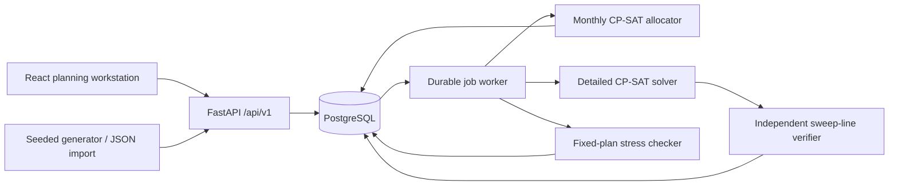

# Architecture

RailShield is a modular monolith with a separate CPU worker. The domain and optimization packages import neither FastAPI nor SQLAlchemy. This allows CLI solving, property tests, future worker partitioning and reuse outside the web application.

## State and execution

Datasets are immutable JSON snapshots with UUIDs and canonical-content hashes. Jobs persist their request before returning HTTP 202. A worker claims the oldest queued job inside a transaction; PostgreSQL uses `FOR UPDATE SKIP LOCKED`. The solver runs after the transaction commits so database locks are not held during optimization. Completion checks the claim token and running state, preventing stale results from overwriting an expired job.

A 15-minute lease marks abandoned jobs failed when a worker next polls. Jobs are not silently retried: explicitly submit another run. Leases exceed the bounded two-solve jobs (at most 60 seconds CP-SAT time plus model construction). Model-size limits constrain construction; there is no OS-enforced memory quota in the local runner. Apply container resource quotas appropriate to your hardware.

SQLite is a single-worker development path. PostgreSQL supports multiple worker processes. Queue admission uses a PostgreSQL transaction advisory lock and rejects submissions above the configured active-job limit with 429. There is no distributed scheduler, broker, WebSocket layer or hidden background thread in the API.

## Vercel profile

Vercel uses `api/index.py`, a root dependency manifest, and the static Vite output in
`frontend/dist`. It does not run the durable worker. The frontend switches to a stateless adapter at
build time: datasets and job history live in browser local storage, and complete immutable inputs are
posted to bounded `/api/v1/stateless/*` endpoints. This profile is suitable for the public SIH demo;
it does not claim shared persistence. The PostgreSQL/worker profile remains the production reference
for collaborative planning.

## Immutable recovery

Recovery requests reference a completed, verified job from the same dataset lineage. The API snapshots the parent's plan and effective dataset into the new request. Recovery outputs the disrupted dataset as well as the new plan. Subsequent recovery/stress operates on that snapshot, preserving accumulated disruptions. The original dataset and original plan remain unchanged.

The frontend uses the selected job's baseline and only displays stress results attached to that selected parent. JSON exports contain job IDs and objective diagnostics. The audit endpoint records creation, queuing, completion and failures, without storing authentication secrets.

## API contract

- `GET /health/live`, `GET /health/ready`: unauthenticated process/database checks.
- `POST /api/v1/datasets`: validate and persist a version 1 JSON dataset.
- `POST /api/v1/datasets/generate`: deterministic generator configuration.
- `GET /api/v1/datasets`, `GET /api/v1/datasets/{id}`: recent datasets and immutable detail.
- `POST /api/v1/jobs`: monthly, optimize, stress or recovery, returning queued state.
- `GET /api/v1/jobs?dataset_id=...`, `GET /api/v1/jobs/{id}`: persisted state/results.
- `GET /api/v1/audit`: recent audit events.

All `/api/v1` routes share the bearer-key dependency. OpenAPI describes request schemas; `datasets/schema.json` is the portable input schema. HTTP failures are distinct from solver infeasibility: a successfully executed optimization can complete with `INFEASIBLE`, which is not a worker error.

## Security and deployment boundaries

Production requires PostgreSQL and a nonempty 32-character key, explicit CORS origins, bounded bodies and bounded jobs. Nginx supplies CSP and security headers. Bundled fonts and all application assets work offline after installation. Source data stays local during normal application operation.

Current authentication has one deployment principal. Per-user identity, RBAC, tenant separation, approval signatures, tamper-evident audit retention and rate limits at the ingress are future deployment work. Do not expose a development API publicly. Railway data ingestion requires ownership, field mapping and rule validation agreements; none of those are implied by the synthetic fixtures.
